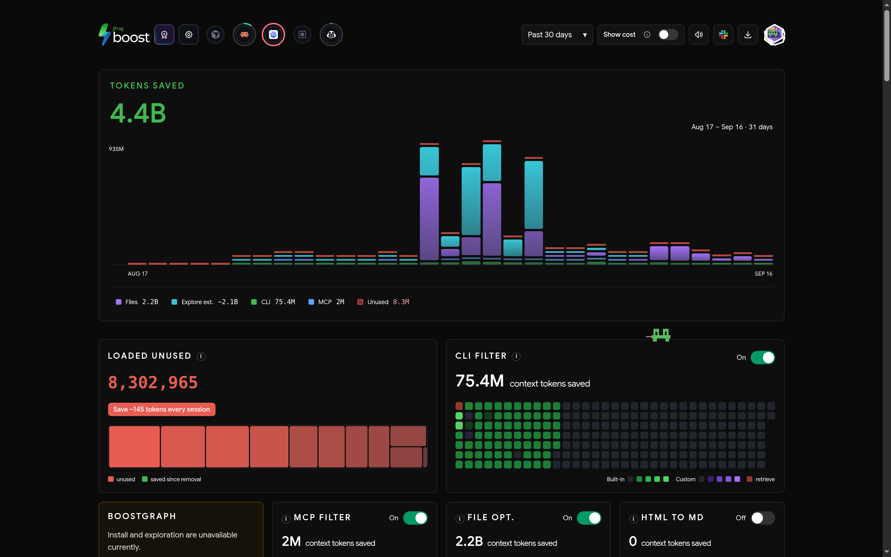

# Boost output filters

Custom [JFrog Boost](https://github.com/jfrog/boost) filters that compact noisy command output before it reaches a coding agent, published from the install they actually run on.

Boost ships around 220 built-in filters. These six cover gaps that showed up when the recorded output of a month's agent work was measured: test runners whose passing rows dominate the output, a linter whose table padding is most of its bytes, and one built-in whose rule removed detail a `-v` run had explicitly asked for.

Every filter here is tuned to one rule: **savings must never cost the agent signal.** Failures, errors, warnings, summaries and anything a command explicitly selected are kept, even where dropping them would save more.

## What is here

| Filter | Version | What it does |
|---|---|---|
| `testem-tap-passes` | 1 | Drops passing `ok N <Browser> - [N ms] -` rows from full, unpiped ember/testem runs. Keeps every `not ok` block with its YAML detail, `skip`/`todo` rows, the `# tests/pass/fail` summary and console errors. Scoped (`--filter`) runs and anything piped into a line selector are left alone. |
| `lint-row-padding` | 1 | Collapses the column-alignment padding in stylelint/eslint/template-lint problem rows of `npm run lint`. Every row, position, severity, message and rule name survives; only whitespace goes. |
| `pytest-core` | 1 | A replacement for the built-in `pytest` filter, whose progress-line rule also deleted the per-test rows that `-v` prints. Keeps `-v` and `-rA` rows, bare rules and every failure; still drops the session preamble and per-file progress. |
| `pytest-traceback-dedupe` | 2 | Drops byte-identical repeats of long Python source and locals lines when one fixture breaks a whole suite. Keeps every `>`, `E`, frame pointer and summary line — and, since v2, anything that is not source code. |
| `unittest-rules` | 2 | Drops `unittest`'s decorative `====`/`----` rules and the tracemalloc hint in real `python -m unittest` / `manage.py test` runs. Keeps every `FAIL`/`ERROR`, traceback, caret row and summary. |
| `git-diff-headers` | 2 | Drops the `--- a/… / +++ b/…` pair that repeats the `diff --git` line above it, in the output of `git diff`/`show`/`log -p` and `gh pr diff`. Keeps `/dev/null` headers, hunks, changes and context. Since v2 it runs only when the output really is a patch, so header lines an agent grepped for are left alone. |

Each file carries its own `[[tests]]` cases, so a filter documents its own behaviour and can be checked without installing it.

They need Boost v0.13.20 or later: `git-diff-headers` uses `match_mode = "all"`, which older releases do not have.

## How these copies are produced

They are generated, never hand-copied. The skill in this repository copies the live filters into a throwaway directory, rewrites them, verifies them, and only then updates `filters/`.

What that rewriting does, and does not, touch:

- **Filter behaviour is never modified.** Only comments, `description` values and `[[tests]]` fixtures can be rewritten. Every field the engine acts on is copied byte-for-byte, and the published file is compared against the source structurally before it is written — if any behaviour field differs, nothing is published.
- **Fixtures are realistic in shape, not literal.** The tests are derived from real recorded output, so their line shapes, column widths and failure structure are genuine. Identifiers that appeared in them have been replaced with neutral equivalents through a mapping that stays on the machine and is not part of this repository.
- **Two gates run before anything is committed:** a scan for identifying or credential-shaped strings, and a run of every filter through the real `boost` binary: `boost filters validate`, then its own tests under a throwaway `HOME`, which proves the published fixtures still produce their expected output.

## Installing

### From the archive

`dist/boost-filters.zip` is built for `boost filters import`, which takes the zip the report's "Share My Filters" action produces, or an archive of `filters/*.toml`:

```bash
# while this repository is private (uses your gh auth)
gh api repos/rperez93/JFrogBoostFilters/contents/dist/boost-filters.zip \
   -H "Accept: application/vnd.github.raw" > boost-filters.zip

# or, once it is public
curl -fLO https://github.com/rperez93/JFrogBoostFilters/raw/main/dist/boost-filters.zip

boost filters import boost-filters.zip     # --force to overwrite existing filenames
```

It prints what it installed, writes to `~/.boost/filters/`, and skips filenames you already have unless `--force` is given. Reload the agent afterwards so a running session picks them up.

Note that GitHub's own **Download ZIP** button will not work here: Boost accepts only `filters/*.toml` or `*.toml` inside an archive and rejects anything else, and that download wraps everything in a repository folder. `dist/boost-filters.zip` exists for exactly this reason — it is generated, deterministic, and contains nothing but the six filters.

### From a clone

```bash
git clone https://github.com/rperez93/JFrogBoostFilters
cp JFrogBoostFilters/filters/*.toml ~/.boost/filters/
boost filters show          # they appear as `global` filters
```

`pytest-core` replaces a built-in, so disable that one or both will run on the same output:

```bash
boost filters disable toml:builtin:pytest
```

Note that this is stored as the bare name `pytest`, which is why the replacement is called `pytest-core` — a custom filter named `pytest` would be disabled by the same entry.

To roll back, delete the files you copied and re-enable the built-in:

```bash
rm ~/.boost/filters/{testem-tap-passes,lint-row-padding,pytest-core,unittest-rules,git-diff-headers,pytest-traceback-dedupe}.toml
boost filters enable toml:builtin:pytest
```

Take a copy of your existing `~/.boost/filters/` and `~/.boost/config.toml` first if you already have customisations.

## Checking them yourself

```bash
python3 skills/boost-filter-publish/scripts/verify_filters.py \
    --dir filters --commands skills/boost-filter-publish/reference/commands.toml
```

Boost's own validator checks the same files:

```bash
for f in filters/*.toml; do boost filters validate "$f"; done
```

The script runs every filter's test cases through your own `boost` binary, each filter in isolation with the others disabled, and scans the files for anything that should not be published. It needs nothing from the machine these came from.

## Local impact

<!-- metrics:start -->

*Measured on the install these filters come from, over the last 30 days; refreshed automatically, last on 2026-09-16.*

| | |
|---|---|
| Commands recorded | 109,848 |
| Tokens removed from tool output | 28.9M |
| Tokens never re-sent in later turns | 4.4B |
| Estimated cost avoided | $21,930 |
| Estimated CO₂e avoided | 921.1 kg |

These filters' own share of that, by filter:

| Filter | Enabled | Events | Tokens before | Tokens after | Saved | Retrieves |
|---|---|---:|---:|---:|---:|---:|
| `git-diff-headers` | yes | 2,600 | 11.7M | 11.6M | 1% | 0 |
| `unittest-rules` | yes | 4,028 | 4.6M | 4.5M | 3% | 6 |
| `pytest-traceback-dedupe` | yes | 1,218 | 736.2K | 625.2K | 15% | 2 |
| `lint-row-padding` | yes | 0 | 0 | 0 | — | 0 |
| `pytest-core` | yes | 0 | 0 | 0 | — | 0 |
| `testem-tap-passes` | yes | 0 | 0 | 0 | — | 0 |

A retrieve count above zero means an agent had to recover output that a filter chain removed — the number these filters are tuned to keep at zero. Before Boost v0.13.20 a retrieve was attributed to every filter in the chain that handled the command, including filters that changed nothing ([jfrog/boost#85](https://github.com/jfrog/boost/issues/85), fixed 2026-09-16), so counts recorded before that release are not proof that this filter was the one responsible.

Rows with no events have not yet matched a command inside the window — a filter added recently starts at zero and fills in as work runs.



*The report UI on the same install.*

<!-- metrics:end -->

## The skill

`skills/boost-filter-publish/` holds the skill that produces everything above: it scrubs, verifies, refreshes the metrics in this README, and commits. It lives here and is symlinked into `~/.claude/skills/`, so the repository is the single copy.

```bash
ln -s "$PWD/skills/boost-filter-publish" ~/.claude/skills/boost-filter-publish
```

It is written to be generic: the filter directory, the identifying terms and the alias mapping are all inputs, so it works for anyone's install rather than only the one these filters came from.

## Related upstream reports

Four engine behaviours found while building these, reported against Boost v0.13.19. All four were closed as completed by JFrog on 2026-09-16:

- [x] [jfrog/boost#83](https://github.com/jfrog/boost/issues/83) — regex lookaheads are silently ignored in filters. *Fixed 2026-09-16 in v0.13.20*: filter validation now reports invalid regular expressions, and the `gha-log` rule was repaired.
- [x] [jfrog/boost#84](https://github.com/jfrog/boost/issues/84) — `match_command` and `match_output_select` combine with OR. *Fixed 2026-09-16 in v0.13.20*: an opt-in matching mode now requires every selector to match.
- [x] [jfrog/boost#85](https://github.com/jfrog/boost/issues/85) — retrieve counts are attributed to every filter in a chain. *Fixed 2026-09-16 in v0.13.20*: retrieves now go only to filters that changed the output.
- [x] [jfrog/boost#86](https://github.com/jfrog/boost/issues/86) — the retrieval marker can make short outputs larger. *Fixed 2026-09-16 in v0.13.21*: the marker is skipped when it would make the output larger than the original.

The first two shaped how these filters were written: exclusions are expressed positively rather than with lookaheads, and a filter that must not touch someone else's output carries no output fingerprint at all. After #84 was fixed, each filter was measured against a month of recorded commands to decide its selection mode. `git-diff-headers` now uses `match_mode = "all"`, with its command widened to every git or gh subcommand that prints a patch. `pytest-core` keeps `"any"` on purpose, because most of its savings come from pytest runs inside compound scripts. The other four stay command-only, because an output gate would have blocked only real test runs. The reasoning and the numbers are in each file's header comment.
